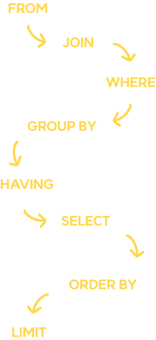

# sql 쿼리 실행 순서

### 별칭으로는 where절이 안돼😅

데이터들을 조합하고 사용하기 위해 여러 테이블들을 조합하게 되며 그 과정에서 `JOIN`과 `SubQuery`등을 사용하게 됐다. 그리고 위의 두가지를 사용하다보니 자연스레 별칭(Alias)을 사용하게 되는데 이때 문제가 발생했다. `FORM`


#### where절에 컬럼명을 별칭으로 사용했더니 오류가 발생한다.

<br>

쿼리 구문은 이랬다.
```sql
SELECT `A_table`.*, 
`B_as`.`mem_nickname` AS `target_nickname` 
FROM `A_table` 
LEFT JOIN `B_table` AS `B_as` ON `B_as`.`mem_id` = `A_table`.`mem_id` 
WHERE `target_nickname` LIKE '%검색어%' ESCAPE '!'
```
에러 : `Unknown column 'target_nickname' in 'where clause'`

<br>
컬럼명을 인식하지 못하는 에러였다.<br>
처음에는 "JOIN을 이상하게 했나?" 라고 생각하여 문제를 해결하기 위해 코드를 처음부터 되짚어보고 수정하며 확인했다. 하지만 문제가 확인되지않았고 다른 원인을 생각하다, 별칭을 전부 빼고 쿼리를 실행해보았다.
<br><br>

### 됐다
<br>

 문제를 해결하고 컬럼에 선언한 별칭은 where절에 사용하면 안되는구나 알았지만 정확한 이유는 찾아보지 못하다 이제서야 알아보게 됐다.(~~회사 일이 너무 많아서 공부할 시간이 없~~)

 <br>


 ### SQL은 언어다.<br><br> 언어는 문법이 존재한다. <br><br> 대다수 언어의 문법에는 순서가 존재한다.

<br>
<br>
<p align="center">

</p>

<br>

쿼리에는 실행 순서가 존재했다. 쿼리의 실행 순서를 정리한 위의 내용을 보면, `FROM`과 `WHERE`절 이후에 `SELECT`절이 실행되는 것을 확인할 수 있다. 따라서 `WHERE`절은 오로지 `FROM`절에서 조회한 결과값을 가지고 필터링한다는 것이었다.<br>
이 순서에 의하면 `WHERE`절 이후에 `SELECT`절이 실행되므로 `SELECT`에서 별칭으로 지정한 칼럼을 `WHERE`절에서 읽지 못한다.

### 추가로
쿼리 순서를 통해 알게 된 것이 있다. `ORDER BY`절은 `SELECT`이후 실행된다는 것이다. 따라서 `SELECT`절에서 지정한 별칭은 `ORDER BY`에서 사용이 가능하다.
<br> 

## 마치며

흔히 듣는 말로 `기본이 제일 중요하다.` 를 느끼게 된 공부였다. 정말 기본적인 내용을 모르고 언어를 사용하고 있었다는 것에 대해 반성하게 되고 이때까지 작성했던 쿼리가 부실해 보일 수도 있다는 생각에 지난 날들을 후회하게 됐다... 앞으로는 어떠한 것이라도 기본기를 우선적으로 공부를 해야 할 것 같다.


